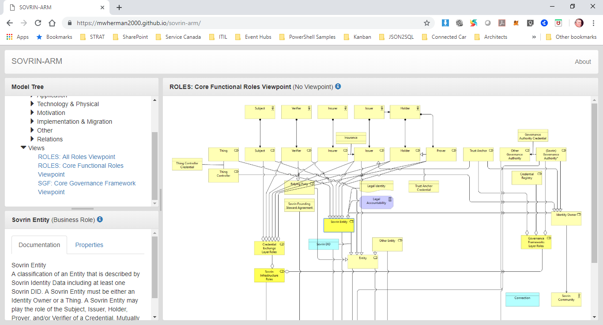
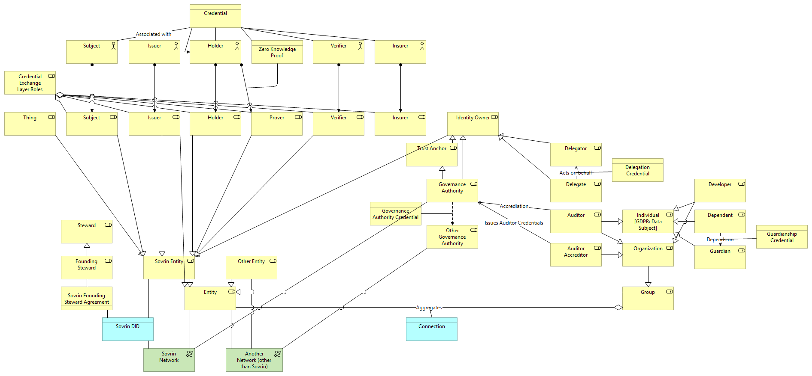

# sovrin-arm - Sovrin Governance Framework Comprehensive Architecture Reference Model (SOVRIN ARM)

_Draft document for discussion purposes_

Update cycle: As required – sometimes several times in a single day.

## Current Scope

The current SOVRIN ARM model contains more than 100 elements including the following:
- All role elements (and closely related elements)
- All elements in the Appendix B - Taxonomy of Entities diagram
- Most Sovrin Governance Framework documents
- Most Things (and closed related elements)

The remaining elements from the Sovrin Glossary will be added based on demand and time.

The original inspiration/driver for creating the SOVRIN ARM was the roles and actors taxonomy diagram in the [HyperLedger Indy Getting Started Guide for Enterprise Architects and Developers (INDY GSG-EA)](https://github.com/mwherman2000/indy-gsg-ea/blob/master/python/doc/getting_started-enterpise.md#additional-actors).

## SOVRIN ARM Interactive Explorer

Click here: [SOVRIN ARM Interactive Explorer](https://mwherman2000.github.io/sovrin-arm/)

NOTE: The above SOVRIN ARM Interactive Explorer is completely separate (for now) from the [Hyperledger Indy/Sovrin/DID Comprehensive Architecture Reference Model (INDY ARM)](https://github.com/mwherman2000/indy-arm/blob/master/README.md#indy-arm---hyperledger-indysovrindid-comprehensive-architecture-reference-model-indy-arm). The former is the ARM for the Sovrin Governance Framework while the latter is the ARM for the Hyperledger Indy software platform.

### Use Cases

1. Creating domain-specific subsets and supersets of the Sovrin terminology.  This is easily accomplished in the SOVRIN ARM using tags/metadata on each element on the model.
2. Item-level tracking, approvals, versioning, etc. is another application of tags and metadata to the elements in SOVRIN ARM model.
3. Role hierarchy tree diagram in Appendix B – Taxonomy of Entities.  In a recent conference call, it was hard to get approval but people weren’t able to map from the tree diagram to the flat text of the body of the glossary in the available time because these are 2 different, disconnected versions of the truth: the diagram is a one-off drawing that is not easy to correlate the rest of the document. The SOVRIN ARM models this directly enabling the tree diagram to be validated within 30 seconds using the SOVRIN ARM model.

## Sovrin ARM Static Viewpoints

### 1. Sovrin Roles Taxonomy Viewpoint

Figure 1. Sovrin Roles Taxonomy Viewpoint 

### 2. Sovrin Core Roles Taxonomy Viewpoint

Figure 2. Sovrin Core Roles Taxonomy Viewpoint 

_To be continued..._

## References

1. [Sovrin Glossary: Public Review Draft 02](https://docs.google.com/document/d/1gfIz5TT0cNp2kxGMLFXr19x1uoZsruUe_0glHst2fZ8/edit?pli=1#)
2. [What’s the Difference: Glossary, Dictionary, Taxonomy, Ontology?](https://thedatamaven.net/2017/04/whats-the-difference-glossary-dictionary-taxonomy-ontology/)
3. [How we think about how we work](https://hyperonomy.com/2016/05/09/how-do-we-think-about-how-we-work/)
